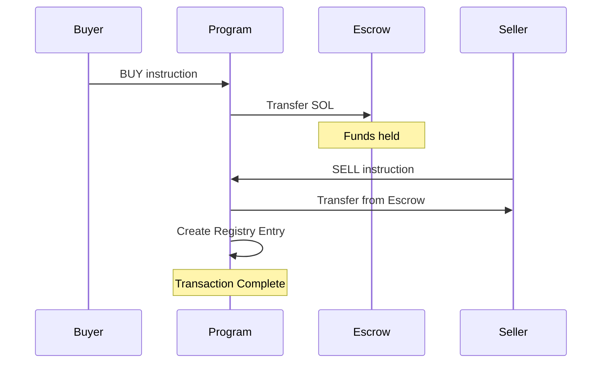

# 🛒 Solana Marketplace Smart Contract

> A decentralized marketplace (OLX-style) smart contract built on Solana blockchain using Rust and zero-copy deserialization

[](https://solana.com/)
[](https://www.rust-lang.org/)
[](LICENSE)

## 📋 Overview

A production-ready Solana program that enables users to create a decentralized marketplace where they can list items for sale, manage purchases, and execute secure peer-to-peer transactions with escrow functionality. Built with zero-copy architecture using Bytemuck for optimal performance and minimal compute units consumption.

### 🎯 Key Features

- **Item Listing Management** - Create, update, and delete product listings
- **Escrow System** - Secure SOL holding during transactions
- **Buy/Sell Workflow** - Complete transaction lifecycle with buyer protection
- **Immutable Transaction Registry** - On-chain proof of completed transactions
- **PDA-Based Security** - Program Derived Addresses for account ownership
- **Zero-Copy Architecture** - Efficient data serialization with Bytemuck

## 🏗️ Architecture

### Program Instructions

| Instruction | Description | Required Accounts |
|------------|-------------|-------------------|
| `INIT` | Create new item listing | `[payer, pda_account, system_program]` |
| `UPDATE` | Modify existing listing | `[payer, pda_account]` |
| `DELETE` | Remove listing & refund rent | `[payer, pda_account]` |
| `BUY` | Initiate purchase with escrow | `[buyer, post_account, buy_pda, holder_account, system_program]` |
| `SELL` | Complete transaction | `[seller, buyer, buy_account, post_account, holder_account, system_program, registry_account, temp_account]` |
| `CANCEL` | Cancel purchase & refund | `[buyer, buy_account, holder_account]` |
| `HOLD_ACCOUNT` | Create holder accounts | `[payer, holder_account, system_program]` |

### Data Structures

```rust
// Main listing data stored on-chain
InitAccountData {
    item_id: [u8; 32],      // Unique item identifier
    title: [u8; 128],       // Item title
    description: [u8; 1024], // Item description
    price: u64,             // Price in lamports
    payer: [u8; 32],        // Seller's public key
}

// Purchase intent data
BuyData {
    item_id: [u8; 32],      // Item being purchased
    buyer: [u8; 32],        // Buyer's public key
    seller: [u8; 32],       // Seller's public key
    price: u64,             // Agreed price
}

// Immutable transaction record
ImmutableRegistryData {
    item_id: [u8; 32],
    buyer: [u8; 32],
    seller: [u8; 32],
    price: u64,
    title: [u8; 128],
    description: [u8; 1024],
    timestamp: u64,         // Unix timestamp
}
```

### PDA Seeds Structure

| Account Type | Seeds | Purpose |
|-------------|-------|---------|
| Item Listing | `["INIT", seed, payer_pubkey]` | Store item data |
| Buy Order | `["BUY", seed, buyer_pubkey]` | Track purchase intent |
| Escrow Holder | `["HOLDER", item_id]` | Hold funds during transaction |
| Temp Holder | `["TEMP", buyer, seller, item_id]` | Temporary fee holder |
| Registry | `["IMUTABLE", item_id, buyer, seller]` | Transaction proof |

## 🚀 Getting Started

### Prerequisites

- Rust 1.70+
- Solana CLI tools 1.14+
- Anchor Framework (optional)

### Installation

1. **Clone the repository**
```bash
git clone https://github.com/yourusername/solana-marketplace
cd solana-marketplace
```

2. **Build the program**
```bash
cargo build-bpf
```

3. **Deploy to devnet**
```bash
solana program deploy target/deploy/marketplace.so --url devnet
```

### Configuration

Set your Solana configuration:
```bash
solana config set --url devnet
solana config set --keypair ~/.config/solana/id.json
```

## 💻 Usage Examples

### Creating a Listing

```javascript
// Client-side code example
const createListing = async (
    title: string,
    description: string,
    price: number,
    itemId: string
) => {
    const seed = crypto.randomBytes(31); // 31 bytes + null terminator
    
    const [pdaAddress] = await PublicKey.findProgramAddress(
        [Buffer.from("INIT"), seed, payer.publicKey.toBuffer()],
        programId
    );
    
    const instructionData = Buffer.concat([
        Buffer.from([0]), // INIT instruction
        // ... serialize InitData
    ]);
    
    // Send transaction
};
```

### Transaction Flow



## 🔒 Security Features

### Account Validation
- **Signer Verification** - All critical operations require proper signatures
- **PDA Validation** - Ensures accounts are derived with correct seeds
- **Owner Checks** - Verifies program ownership of PDAs

### Fund Safety
- **Escrow Protection** - Buyer funds held securely until transaction completion
- **Atomic Operations** - All-or-nothing transaction execution
- **Refund Mechanism** - Cancel operation returns funds to buyer

### Data Integrity
- **Immutable Registry** - Permanent on-chain transaction records
- **Zero-Copy Safety** - Type-safe serialization with Bytemuck
- **Rent Exemption** - Accounts maintain minimum balance for permanence

## 🧪 Testing

Run the test suite:
```bash
cargo test
```

For integration testing on devnet:
```bash
# Deploy to devnet first
solana program deploy target/deploy/marketplace.so --url devnet

# Run integration tests
npm run test:integration
```

## ⚡ Performance Optimization

### Zero-Copy Architecture
- Uses `Bytemuck` for direct memory mapping
- No heap allocations during deserialization
- Minimal compute unit consumption

### Efficient PDA Usage
- Deterministic address generation
- Batch account fetching where possible
- Optimized seed structures

## 📊 Transaction Costs

| Operation | Estimated Cost (SOL) | Compute Units |
|-----------|---------------------|---------------|
| Create Listing | ~0.00203 | ~15,000 |
| Update Listing | ~0.00001 | ~8,000 |
| Buy (Escrow) | ~0.00204 | ~20,000 |
| Complete Sale | ~0.00407 | ~35,000 |
| Cancel Purchase | ~0.00001 | ~12,000 |

## 🛠️ Development

### Project Structure
```
├── src/
│   └── lib.rs          # Main program logic
├── tests/
│   └── integration.rs  # Integration tests
├── Cargo.toml          # Dependencies
└── README.md          # Documentation
```

### Building from Source
```bash
# Install dependencies
cargo build

# Run clippy for linting
cargo clippy

# Format code
cargo fmt
```

## 🤝 Contributing

Contributions are welcome! Please feel free to submit a Pull Request.

1. Fork the repository
2. Create your feature branch (`git checkout -b feature/AmazingFeature`)
3. Commit your changes (`git commit -m 'Add some AmazingFeature'`)
4. Push to the branch (`git push origin feature/AmazingFeature`)
5. Open a Pull Request

## ⚠️ Disclaimer

This smart contract is provided as-is for educational purposes. Ensure thorough testing and auditing before mainnet deployment. The authors are not responsible for any loss of funds.

## 📄 License

This project is licensed under the MIT License - see the [LICENSE](LICENSE) file for details.

## 👥 Authors

- **[Ashutosh negi]** - Initial work - [GitHub](https://github.com/ashutoshnegi120)

## 🙏 Acknowledgments

- Solana Foundation for the blockchain platform
- Rust community for excellent documentation
- Bytemuck creators for zero-copy serialization

---

**Note:** This is a demonstration project showcasing Solana program development with Rust. Always conduct security audits before deploying to mainnet.
